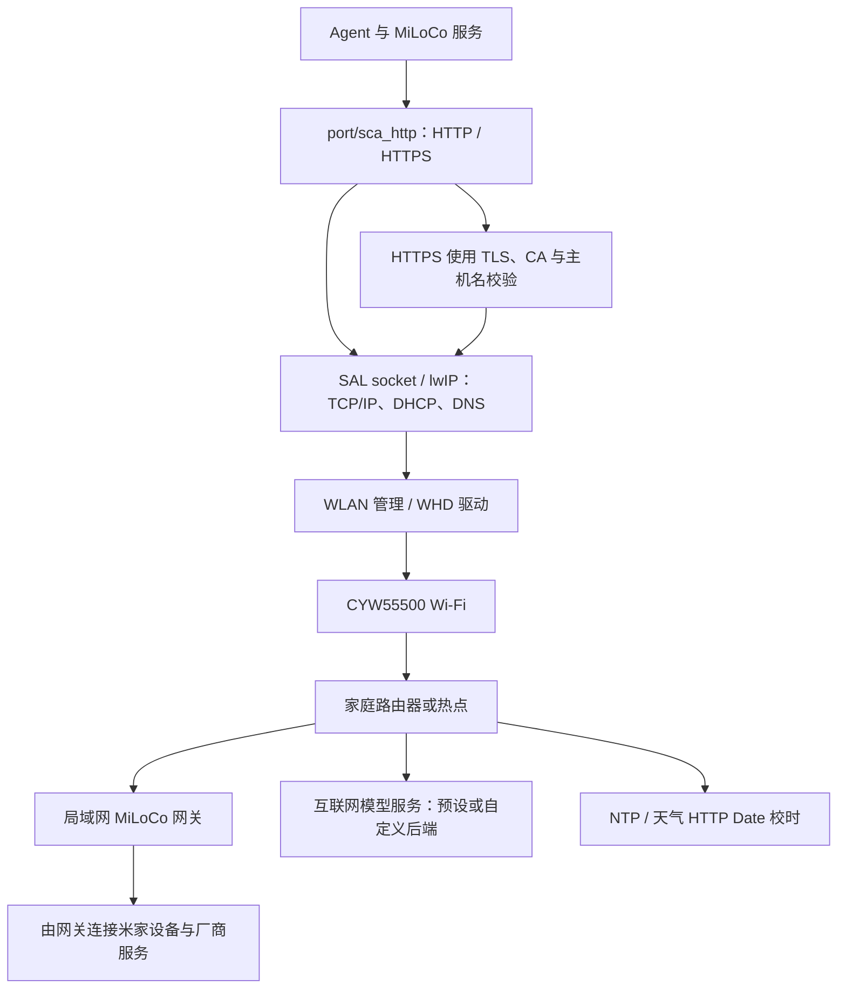

# 图 2-2　板端网络分层与服务出口

```mermaid
flowchart TB
    APP["Agent 与 MiLoCo 服务"] --> HTTP["port/sca_http：HTTP / HTTPS"]
    HTTP --> TLS["HTTPS 使用 TLS、CA 与主机名校验"]
    HTTP --> NET["SAL socket / lwIP：TCP/IP、DHCP、DNS"]
    TLS --> NET
    NET --> WLAN["WLAN 管理 / WHD 驱动"]
    WLAN --> RADIO["CYW55500 Wi-Fi"]
    RADIO --> ROUTER["家庭路由器或热点"]
    ROUTER --> LAN["局域网 MiLoCo 网关"]
    LAN --> DEVICE["由网关连接米家设备与厂商服务"]
    ROUTER --> MODEL["互联网模型服务：预设或自定义后端"]
    ROUTER --> TIME["NTP / 天气 HTTP Date 校时"]
```
