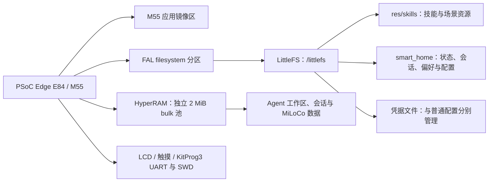

# 图 2-1　应用镜像、LittleFS 文件布局与运行内存

```mermaid
flowchart LR
    SOC["PSoC Edge E84 / M55"] --> IMAGE["M55 应用镜像区"]
    SOC --> FLASH["FAL filesystem 分区"]
    FLASH --> LFS["LittleFS：/littlefs"]
    LFS --> RES["res/skills：技能与场景资源"]
    LFS --> DATA["smart_home：状态、会话、偏好与配置"]
    LFS --> SECRET["凭据文件：与普通配置分别管理"]
    SOC --> RAM["HyperRAM：独立 2 MiB bulk 池"]
    RAM --> BULK["Agent 工作区、会话与 MiLoCo 数据"]
    SOC --> IO["LCD / 触摸 / KitProg3 UART 与 SWD"]
```
